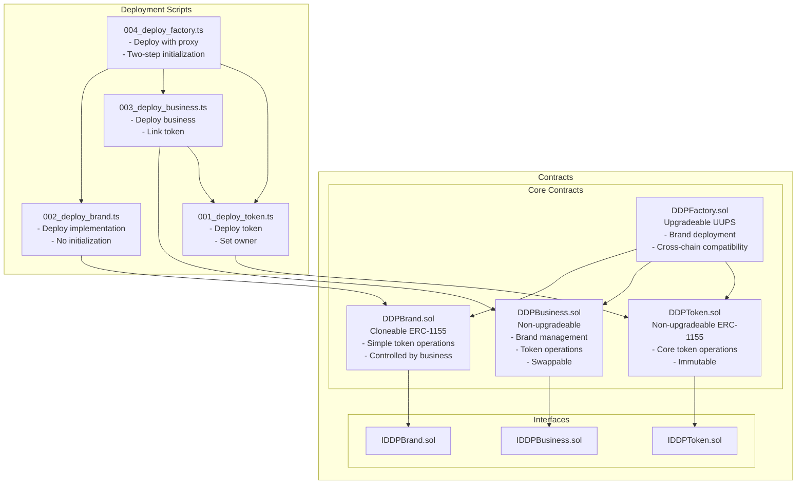
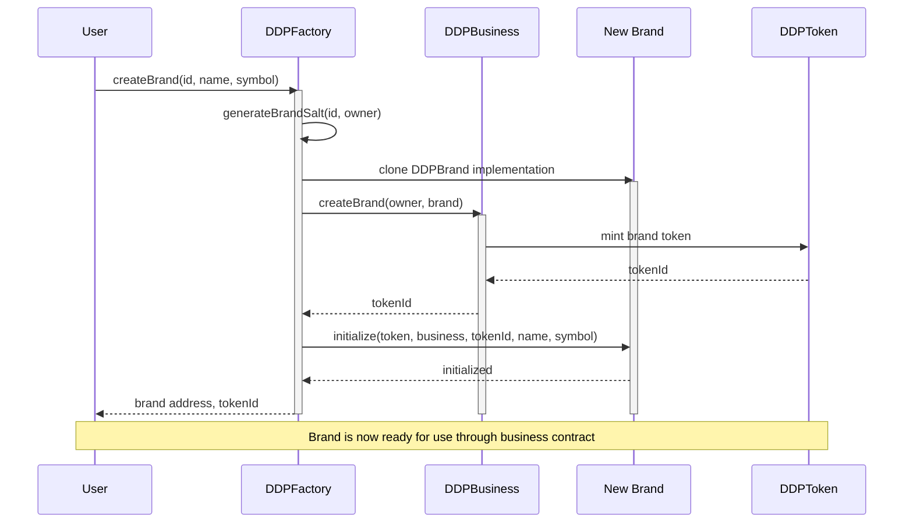
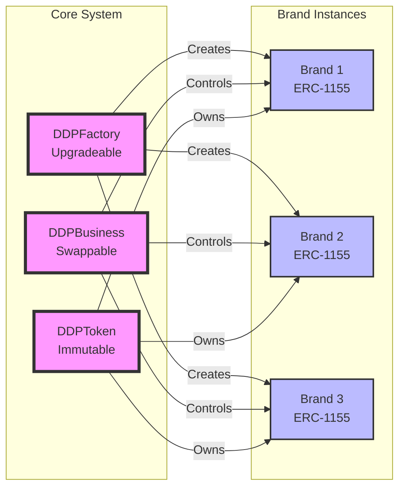

# Contract Architecture

## Contract Files and Components

## Operational Flow

## Component Relationships

## Key Features

### Brand Creation
- Factory creates deterministic brand addresses
- Business handles brand setup and token minting
- Brands are simple ERC-1155 contracts

### Token Operations
- All token operations go through business contract
- Business contract can be swapped for new logic
- Token ownership is immutable

### Cross-Chain Compatibility
- Same brand = same address on all chains
- Uses CREATE2 for deterministic addresses
- Factory handles cross-chain coordination

### Upgrade Paths
- Factory is upgradeable for deployment changes
- Business logic is swappable for new features
- Brand contracts are simple and stable

### Security Model
- Core token functionality is immutable
- Brand operations controlled by business
- Factory upgrades controlled by owner
