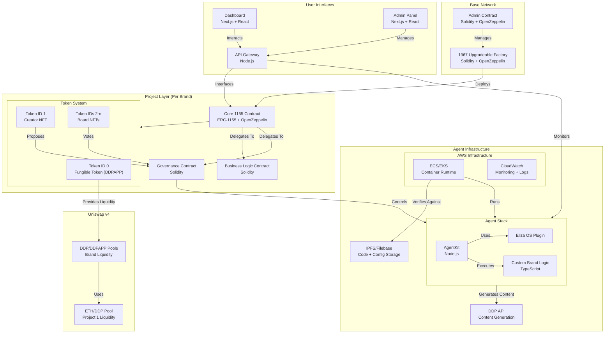

# DDP Apps Factory Architecture

## Overview

The DDP Apps Factory is a platform for creating and managing AI-driven brand entities through NFTs, tokens, and automated brand management. The architecture integrates blockchain, AI agents, and web infrastructure to create a comprehensive brand creation and management platform.

## Service Architecture

## Contract Architecture

### Core Token Contract (ERC-1155)
- **Type**: Non-upgradeable ERC-1155
- **Purpose**: Efficient token operations
- **Responsibilities**:
  - Trading execution
  - Minting execution
  - Balance management
  - Transfer operations
- **Security Model**:
  - Immutable core functions
  - Protected balance tracking
  - Secure transfer logic
  - Delegate access for optional features

### Extension Contract
- **Type**: Upgradeable (ERC-1967)
- **Purpose**: Brand-specific operations
- **Responsibilities**:
  - Brand management
  - Optional feature implementation
  - Agent parameters
  - Business logic
- **Future Considerations**:
  - New trading features
  - Enhanced metadata
  - Additional user utilities
  - Integration endpoints

### Governance Contract
- **Type**: Upgradeable (ERC-1967)
- **Purpose**: Protocol governance
- **Responsibilities**:
  - Agent behavior control
  - External integration management
  - Optional feature approval
  - Protocol parameter management
- **Future Powers**:
  - Agent management
  - Protocol oversight
  - Parameter optimization
  - Emergency responses

## Token System

### Token Standards
The platform uses ERC-1155 for its flexibility and efficiency:
- **Token ID 0**: Fungible token (DDPAPP)
- **Token ID 1**: Creator NFT
- **Token IDs 2-n**: Board NFTs

### Governance Model
- **Type**: Creator-led DAO with NFT voting
- **Structure**:
  - Creator (Token ID 1 holder) submits proposals
  - NFT holders (Token IDs 1-n) vote
  - 1 vote per NFT
  - Creator's vote breaks ties
- **Process**:
  1. Creator submits proposal
  2. NFT holders vote
  3. Tie resolved by creator's vote
  4. Execute approved proposal

## Agent Infrastructure

### Deployment Architecture
- **Code Storage**: IPFS via Filebase
  - Agent code
  - Dockerfile
  - CI/CD configurations
  - Environment setup
  - Verification scripts
- **Runtime**: AWS ECS/EKS
- **Monitoring**: CloudWatch

### Agent Stack
- **Core**: AgentKit (Node.js)
- **Plugins**: Eliza OS
- **Custom Logic**: TypeScript
- **Content Generation**: DDP API

## Frontend Architecture

### User Interfaces
- **Dashboard**: Next.js + React
- **Admin Panel**: Next.js + React
- **API Gateway**: Node.js

### Integration Points
- Blockchain interaction
- Agent monitoring
- Content management
- User operations

## Technical Considerations

### Proxy Pattern (ERC-1967)
- **Pros**:
  - Industry standard for upgradeability
  - Well-audited implementation
  - Storage collision prevention
  - Clear upgrade mechanism
- **Cons**:
  - More complex than non-upgradeable
  - Gas overhead for proxy calls
  - Careful initialization required
  - Storage layout management needed

### Gas Optimization
- **Proxy Overhead**:
  - DELEGATECALL: ~700 gas
  - Extra storage reads: ~200 gas per read
  - Total overhead: ~900-1200 gas per call
- **Impact**:
  - AMM trading: 3-5% additional gas per trade

## Security Principles
1. User sovereignty over tokens
2. Transparent governance
3. Predictable protocol behavior
4. Clear feature documentation
5. No forced token movements
6. Core functions remain immutable
7. Optional features only
