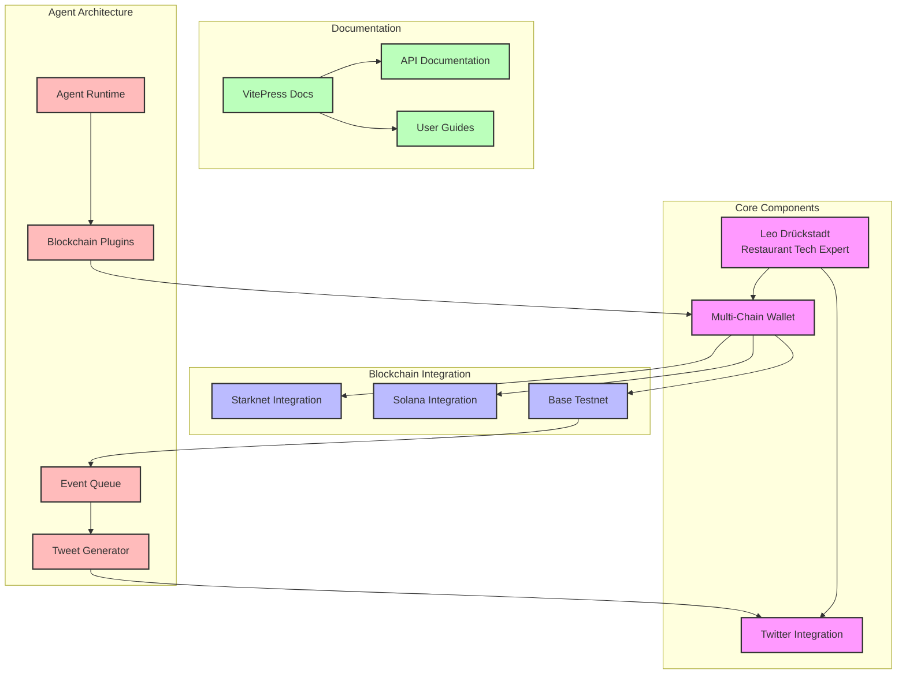

# DDP System Overview

This diagram represents the current understanding of the DDP (Decentralized Digital Persona) system.

<FullscreenDiagram>

</FullscreenDiagram>

## Component Details

### Core Components
- **Leo Drückstadt**: A tech-savvy restaurant expert persona
- **Multi-Chain Wallet**: Handles transactions across different blockchains
- **Twitter Integration**: Manages social media presence

### Blockchain Integration
- **Base Testnet**: Primary network for receiving funds
- **Solana Integration**: Support for Solana blockchain
- **Starknet Integration**: Support for Starknet operations

### Documentation
- **VitePress Docs**: Main documentation system
- **API Documentation**: Technical integration details
- **User Guides**: Usage instructions and examples

### Agent Architecture
- **Agent Runtime**: Core execution environment
- **Blockchain Plugins**: Modular blockchain integrations
- **Event Queue**: Transaction monitoring system
- **Tweet Generator**: Automated content creation
