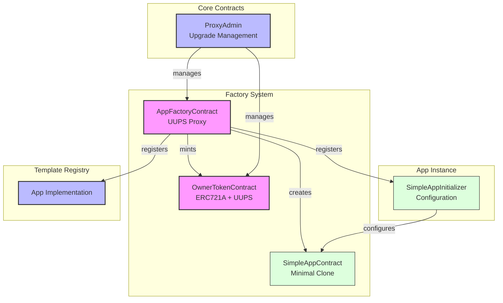
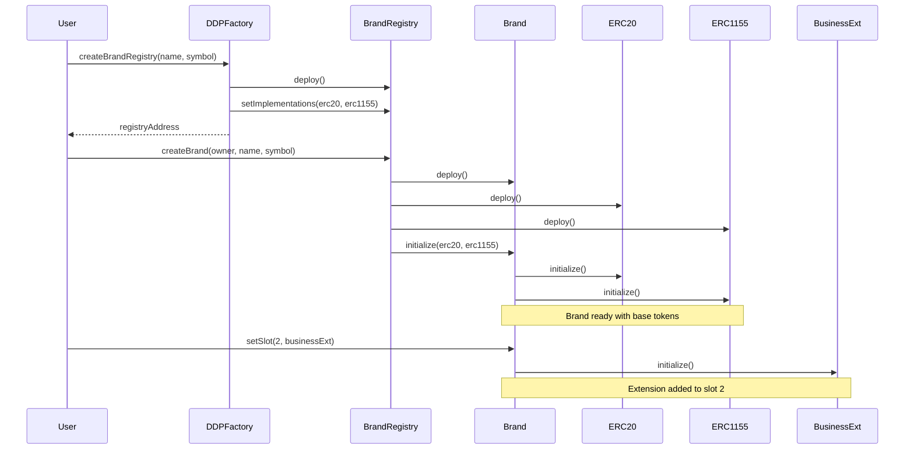

# DDP Smart Contract Architecture

## Overview

The DDP smart contract system consists of three main components:

1. **Factory System**: Creates and manages app instances and their ownership tokens
2. **Core Contracts**: Handles upgradeable proxy management and ownership
3. **App Templates**: Defines the behavior and initialization of app instances

## System Architecture

<FullscreenDiagram>



</FullscreenDiagram>

## Core Contracts

The factory contract is responsible for creating and managing app instances. It is implemented as a UUPS proxy for upgradeability.

```solidity
contract AppFactoryContract is Initializable, OwnableUpgradeable, UUPSUpgradeable {
    // Maps app type to implementation address
    mapping(bytes32 => address) public implementations;
    
    // Maps app type to initializer address
    mapping(bytes32 => address) public initializers;
    
    // Owner token contract reference
    IOwnerToken public ownerTokenContract;
    
    function createApp(
        bytes32 appType,
        string calldata appId,
        string calldata name,
        string calldata symbol,
        bytes calldata initData
    ) external returns (address app, uint256 tokenId);
}
```

### OwnerTokenContract

An ERC721A contract that represents ownership of apps. Each token corresponds to an app instance.

```solidity
contract OwnerTokenContract is Initializable, ERC721AUpgradeable, OwnableUpgradeable, UUPSUpgradeable {
    // Factory that can mint tokens
    address public factory;
    
    function factoryMint(address to) external returns (uint256);
}
```

### SimpleAppContract

The template for app instances. New instances are created as minimal clones of this implementation.

```solidity
contract SimpleAppContract is Initializable {
    bytes32 public constant APP_TYPE = keccak256("SIMPLE_APP_V1");
    
    function initialize(
        address owner,
        uint256 ownerTokenId,
        string calldata name,
        string calldata symbol,
        bytes calldata initData
    ) external initializer;
}
```

### SimpleAppInitializer

Handles initialization logic for SimpleAppContract instances.

```solidity
contract SimpleAppInitializerContract {
    function initialize(
        address app,
        bytes calldata initData
    ) external;
}
```

## Deployment Flow

1. Deploy implementation contracts
   - AppFactoryContract implementation
   - OwnerTokenContract implementation
   - SimpleAppContract implementation
   - SimpleAppInitializerContract

2. Deploy and configure proxies
   - Deploy ProxyAdmin
   - Deploy AppFactoryContract proxy
   - Deploy OwnerTokenContract proxy

3. Initialize contracts
   - Initialize OwnerTokenContract with name and symbol
   - Initialize AppFactoryContract with OwnerTokenContract address

4. Register templates
   - Register SimpleAppContract implementation
   - Register SimpleAppInitializerContract

## App Creation Flow

1. User calls `createApp` on AppFactoryContract
2. Factory mints new owner token
3. Factory creates minimal clone of app template
4. Factory configures app through initializer
5. App is ready for use


<FullscreenDiagram>



</FullscreenDiagram>

## Security Model

1. **Slot Management**
   - Mandatory token slots (0,1)
   - Extension slots (2+)
   - Slot type validation

2. **Access Control**
   - Brand controls slots
   - Extensions control modules
   - Modules have limited scope

3. **Upgradeability**
   - Tokens are immutable
   - Extensions are swappable
   - Modules are flexible
