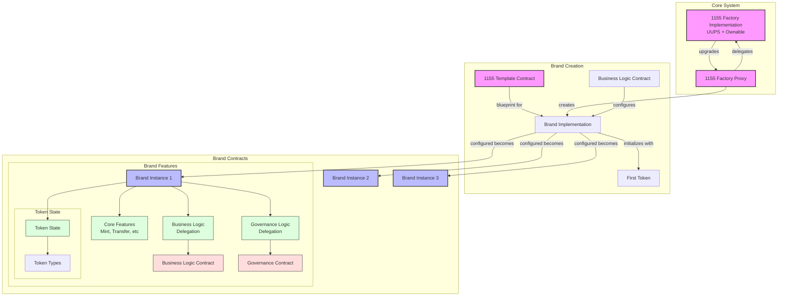
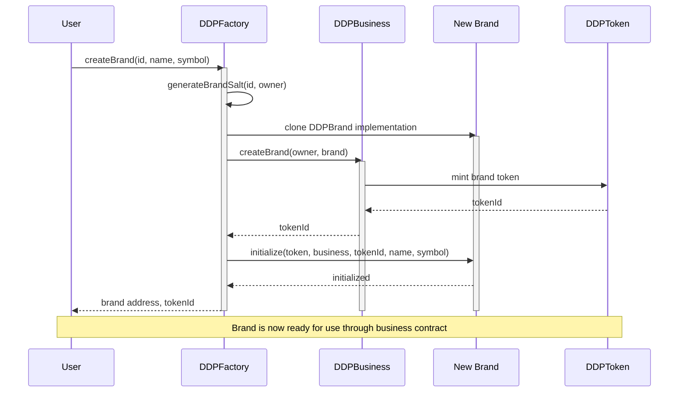
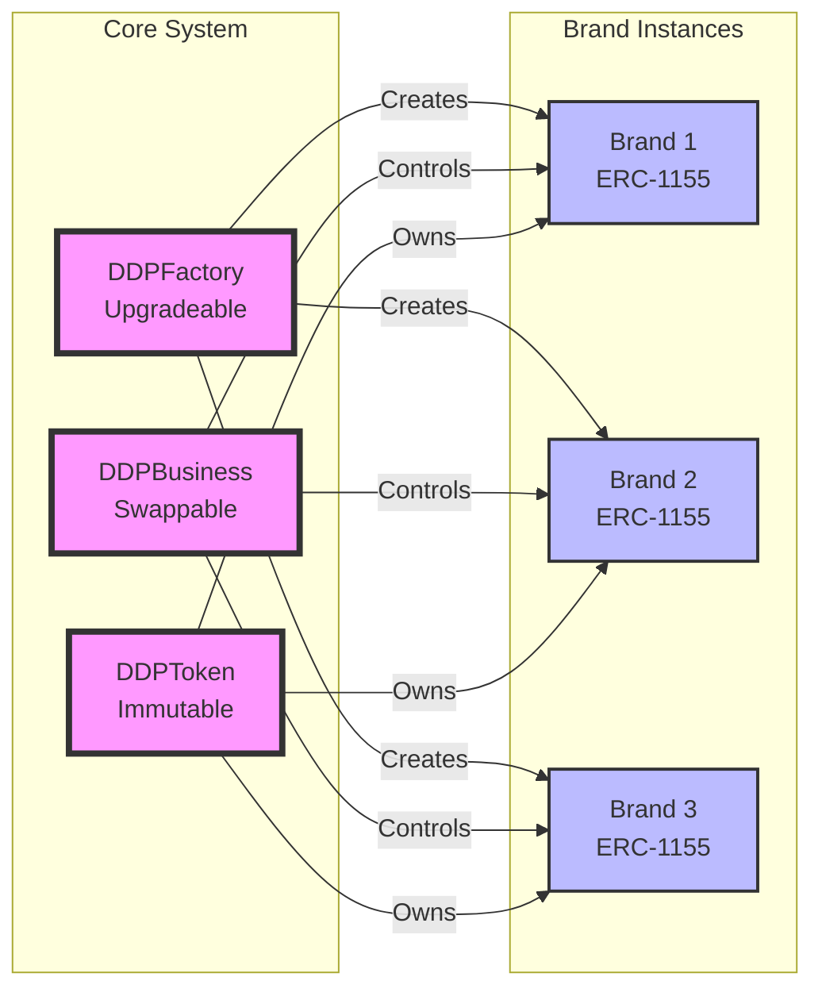

# Contract Architecture

## Contract Files and Components

<FullscreenDiagram>

</FullscreenDiagram>

## Operational Flow

## Component Relationships

## Core Components

### Factory System
- UUPS upgradeable pattern for standard security
- Managed through OpenZeppelin's OwnableUpgradeable
- Creates and initializes new brand instances
- Ensures deterministic addresses across chains

### Brand Template
- Base ERC-1155 implementation
- Core features (minting, transfer, etc)
- Extension points for business and governance logic
- Standardized token state management

### Business Logic
- Delegated business operations
- Swappable implementation for flexibility
- Handles brand-specific rules and operations
- Can be upgraded independently

### Governance Logic
- Delegated governance operations
- Configurable voting and proposal systems
- Manages brand-level decisions
- Can be upgraded independently

### Token State
- Structured token type management
- Support for multiple token categories
- Agent-created branding tokens
- Flexible token metadata

### Security Model
- Proxy admin controls factory upgrades
- Business and governance logic are swappable
- Core features remain immutable
- Clear separation of concerns
