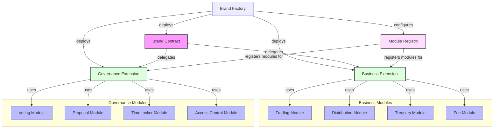

# Brand Contract Concept

- [Brand Contract Concept](#brand-contract-concept)
  - [Overview](#overview)
  - [Extension System](#extension-system)
  - [Module Registry](#module-registry)
  - [Example Usage](#example-usage)
  - [Security Features](#security-features)

## Overview

A Brand Contract is a modular smart contract system that:
1. Delegates business and governance logic to dedicated extensions
2. Uses a module registry to manage functionality
3. Allows dynamic updates through extension and module changes

<FullscreenDiagram>



</FullscreenDiagram>

## Extension System

The Brand Contract uses two main extensions:

```solidity
interface IBusinessExtension {
    // Module Management
    function registerModule(address module) external;
    function unregisterModule(address module) external;
    function isModuleRegistered(address module) external view returns (bool);
    
    // Core Business Logic
    function executeAction(bytes calldata data) external returns (bool);
    function validateAction(bytes calldata data) external view returns (bool);
    
    // Module Access
    function getRegisteredModules() external view returns (address[] memory);
    function canExecute(address module, bytes4 selector) external view returns (bool);
}

interface IGovernanceExtension {
    // Module Management
    function registerModule(address module) external;
    function unregisterModule(address module) external;
    function isModuleRegistered(address module) external view returns (bool);
    
    // Governance Logic
    function propose(bytes calldata data) external returns (uint256 proposalId);
    function execute(uint256 proposalId) external returns (bool);
    function getProposalState(uint256 proposalId) external view returns (uint8);
    
    // Module Access
    function getRegisteredModules() external view returns (address[] memory);
    function canExecute(address module, bytes4 selector) external view returns (bool);
}
```

## Module Registry

The Module Registry manages module registration and access control:

```solidity
interface IModuleRegistry {
    // Module Registration
    function registerModule(
        address extension,
        address module,
        bytes4[] calldata allowedSelectors
    ) external returns (bool);
    
    function unregisterModule(
        address extension,
        address module
    ) external returns (bool);
    
    // Module Queries
    function isModuleRegistered(
        address extension,
        address module
    ) external view returns (bool);
    
    function getModuleSelectors(
        address extension,
        address module
    ) external view returns (bytes4[] memory);
    
    function getRegisteredModules(
        address extension
    ) external view returns (address[] memory);
    
    // Access Control
    function canExecute(
        address extension,
        address module,
        bytes4 selector
    ) external view returns (bool);
}
```

This architecture allows for:
1. **Modular Functionality**: Business and governance features can be added/removed by registering/unregistering modules
2. **Upgradeable Logic**: Extensions can be swapped out to upgrade core business or governance logic
3. **Access Control**: The module registry ensures modules can only execute their registered functions
4. **Separation of Concerns**: Business and governance logic are cleanly separated into different extensions

## Factory System

```solidity
interface IBrandFactory {
    // Deployment
    function createBrand(
        string memory name,
        address businessExtension,
        address governanceExtension,
        bytes memory businessData,
        bytes memory governanceData
    ) external returns (address brand);
    
    // Extension Management
    function setDefaultBusinessExtension(address implementation) external;
    function setDefaultGovernanceExtension(address implementation) external;
    
    // Module Registry
    function setModuleRegistry(address registry) external;
    function getModuleRegistry() external view returns (address);
    
    // Brand Query
    function getBrand(uint256 brandId) external view returns (address);
    function getBrandCount() external view returns (uint256);
    function getBrandsByOwner(address owner) external view returns (address[] memory);
}
```

## Example Usage

```solidity
// Deploy new brand with extensions
address brand = factory.createBrand(
    "My Brand",
    defaultBusinessExt,  // Use default business extension
    defaultGovernanceExt,  // Use default governance extension
    abi.encode(        // Business config
        treasury,
        feeCollector,
        tradingModules
    ),
    abi.encode(        // Governance config
        timelock,
        votingDelay,
        votingPeriod
    )
);

// Register modules
IBusinessExtension(businessExt).registerModule(tradingModule);
IGovernanceExtension(governanceExt).registerModule(votingModule);
```

## Security Features

1. **Governance**
   - All major actions require governance approval
   - Timelocked execution for security
   - Configurable voting parameters

2. **Asset Management**
   - Assets can be disabled but not deleted
   - Each asset has its own permissions
   - Clear audit trail of all actions

3. **Treasury**
   - Holds brand assets and tokens
   - Governed by brand governance
   - Supports multiple tokens

4. **Access Control**
   - Role-based permissions
   - Granular access to assets
   - Emergency pause functionality
