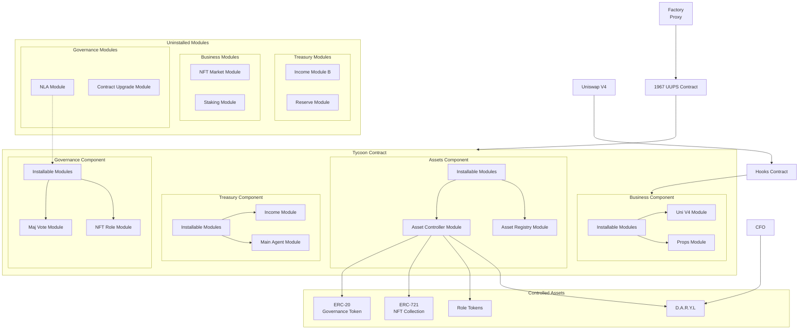

# Latest Architecture

This diagram shows the current architectural design of the DDP system, with its central upgradeable contract, modular components, and controlled assets.

<FullscreenDiagram>

</FullscreenDiagram>

This architecture illustrates:
- Central upgradeable contract created by the factory
- Three main components with installable modules: Treasury, Business, and Governance
- External assets that are controlled by the central contract but not part of its functionality
- External protocol integrations
- Available modules that can be installed into appropriate components
