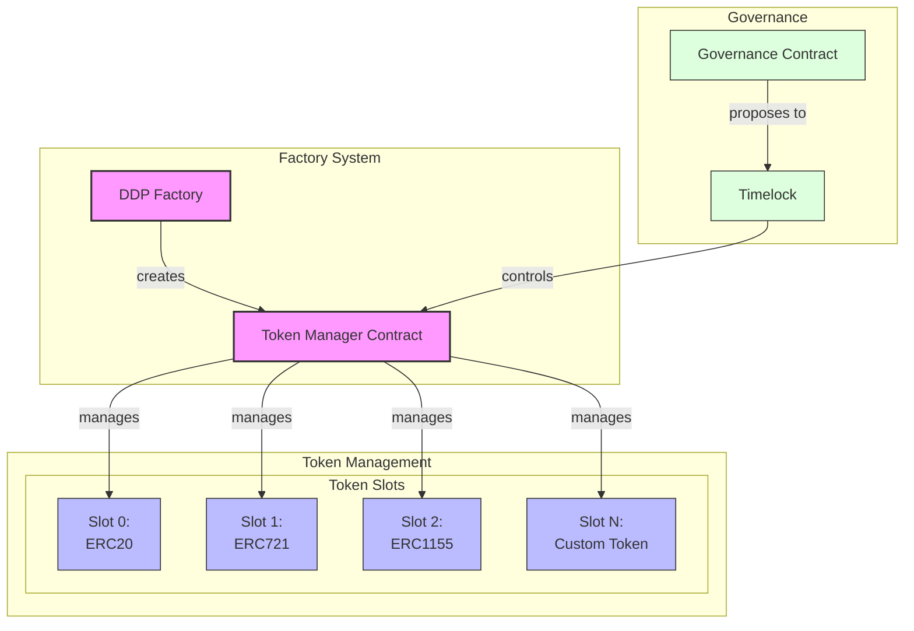

# Token Management Architecture

## Core Components

<FullscreenDiagram>



</FullscreenDiagram>

## Token Manager Interface

```solidity
interface ITokenManager {
    struct TokenSlot {
        address implementation;
        address proxy;
        bool initialized;
        TokenType tokenType;
    }
    
    enum TokenType {
        ERC20,
        ERC721,
        ERC1155,
        Custom
    }

    event SlotInitialized(uint256 indexed slot, address implementation, TokenType tokenType);
    event SlotUpgraded(uint256 indexed slot, address newImplementation);
    event TokenDeployed(uint256 indexed slot, address proxy);

    /**
     * @dev Initialize a new token slot
     * @param slot Slot number to initialize
     * @param implementation Token implementation address
     * @param tokenType Type of token being initialized
     * @param initData Initialization data for the token
     */
    function initializeSlot(
        uint256 slot,
        address implementation,
        TokenType tokenType,
        bytes calldata initData
    ) external;

    /**
     * @dev Upgrade a token implementation
     * @param slot Slot to upgrade
     * @param newImplementation New implementation address
     * @param upgradeData Data for the upgrade
     */
    function upgradeSlot(
        uint256 slot,
        address newImplementation,
        bytes calldata upgradeData
    ) external;

    /**
     * @dev Execute a function call on a token
     * @param slot Slot to call
     * @param data Function call data
     */
    function execute(
        uint256 slot,
        bytes calldata data
    ) external returns (bytes memory);

    /**
     * @dev Get token information for a slot
     * @param slot Slot to query
     */
    function getSlot(uint256 slot) external view returns (TokenSlot memory);
}
```

## Example Usage

```solidity
// Deploy ERC20 token
tokenManager.initializeSlot(
    0, // Slot 0
    erc20Implementation,
    TokenType.ERC20,
    abi.encodeWithSignature("initialize(string,string)", "MyToken", "MTK")
);

// Deploy ERC721 token
tokenManager.initializeSlot(
    1, // Slot 1
    erc721Implementation,
    TokenType.ERC721,
    abi.encodeWithSignature("initialize(string,string)", "MyNFT", "MNFT")
);

// Mint tokens through manager
tokenManager.execute(
    0, // ERC20 slot
    abi.encodeWithSignature("mint(address,uint256)", recipient, amount)
);

// Transfer ownership to governance
tokenManager.transferOwnership(governanceAddress);
```

## Security Model

1. **Access Control**
   - Only owner can initialize slots
   - Only owner can upgrade implementations
   - Token calls must go through manager

2. **Upgradeability**
   - Each token is independently upgradeable
   - Upgrades controlled by governance
   - Timelock for security

3. **Execution**
   - Manager controls all token operations
   - Functions can be restricted
   - Events emitted for tracking
