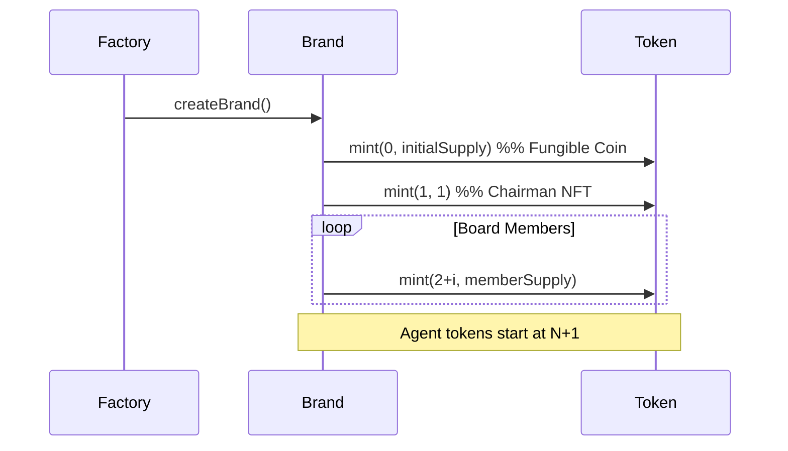
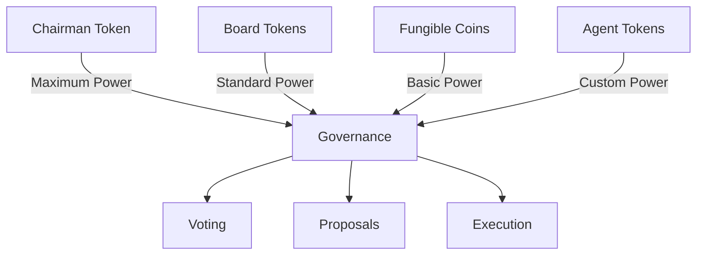

# Token Types

DDP Apps Factory uses ERC-1155 tokens with specific ID ranges for different token types. Each brand has a consistent token ID structure:

## Token ID Structure

| ID Range | Type | Description |
|----------|------|-------------|
| 0 | Fungible Coin | Brand's main fungible token |
| 1 | Chairman NFT | Unique token for brand chairman |
| 2 - N | Board Member Tokens | Limited supply tokens for board members |
| N+1 and above | Agent Tokens | Tokens created by brand agents |

## Token Details

### Fungible Coin (ID: 0)
```solidity
// ERC-1155 fungible token
// Divisible, transferable currency for the brand
{
    id: 0,
    type: "fungible",
    supply: "unlimited",
    divisible: true
}
```

### Chairman NFT (ID: 1)
```solidity
// Single NFT representing brand chairmanship
// Unique governance rights and brand control
{
    id: 1,
    type: "nft",
    supply: 1,
    transferable: true,
    governance: {
        weight: "maximum",
        veto: true
    }
}
```

### Board Member Tokens (ID: 2-N)
```solidity
// Limited supply tokens for board members
// Governance rights and brand oversight
{
    id: "2-N",
    type: "semi-fungible",
    supply: "limited",
    governance: {
        weight: "standard",
        voting: true
    }
}
```

### Agent Tokens (ID: N+1+)
```solidity
// Dynamic tokens created by brand agents
// Custom properties and use cases
{
    id: "N+1 and above",
    type: "dynamic",
    supply: "variable",
    properties: "agent-defined"
}
```

## Token Flow

<FullscreenDiagram>



</FullscreenDiagram>

## Governance Rights

Different token types carry different governance weights and capabilities:

<FullscreenDiagram>



</FullscreenDiagram>

## Implementation

The token type system is enforced through the business logic extension:

```solidity
contract DDPBusiness {
    // Token type constants
    uint256 public constant FUNGIBLE_TOKEN_ID = 0;
    uint256 public constant CHAIRMAN_TOKEN_ID = 1;
    uint256 public constant BOARD_TOKEN_START_ID = 2;
    
    // Track the next available token ID for agent tokens
    mapping(uint256 => uint256) private _nextAgentTokenId;
    
    function getNextAgentTokenId(uint256 brandId) public view returns (uint256) {
        if (_nextAgentTokenId[brandId] == 0) {
            // First agent token starts after board tokens
            return BOARD_TOKEN_START_ID + getMaxBoardMembers(brandId);
        }
        return _nextAgentTokenId[brandId];
    }
    
    function createAgentToken(uint256 brandId, uint256 supply) external returns (uint256) {
        uint256 tokenId = getNextAgentTokenId(brandId);
        _nextAgentTokenId[brandId] = tokenId + 1;
        
        // Mint new agent token
        return tokenId;
    }
}
```

## Security Considerations

1. **Token ID Validation**:
   - Strict range checking
   - Type-specific validation
   - Supply limits

2. **Access Control**:
   - Chairman-only operations
   - Board member privileges
   - Agent restrictions

3. **State Management**:
   - Token type tracking
   - Supply management
   - ID sequence control
