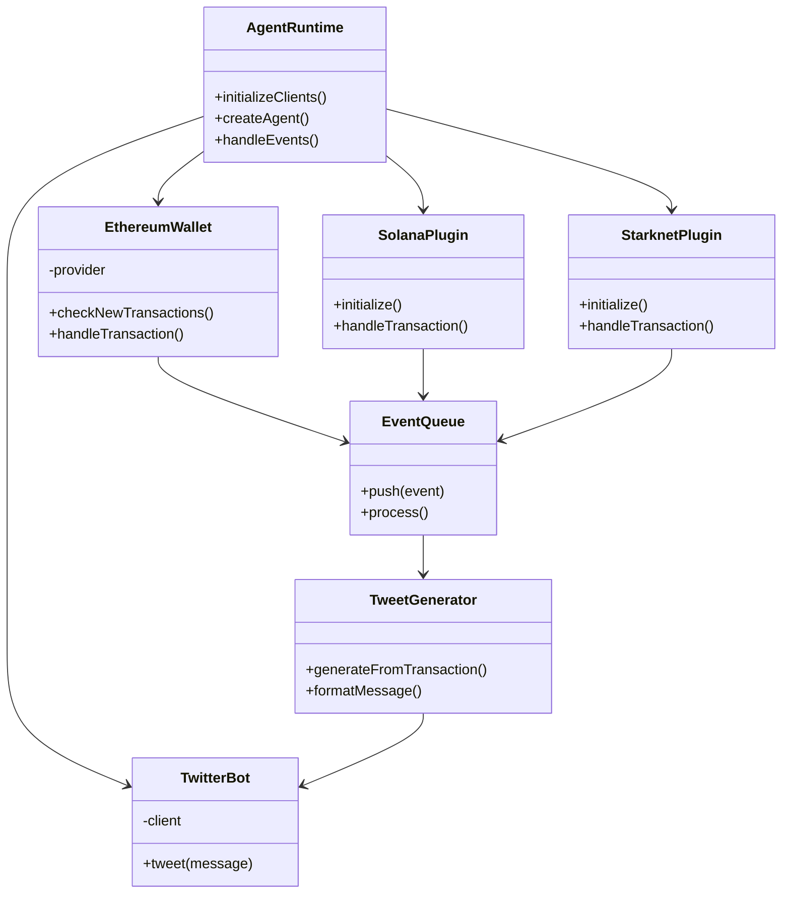
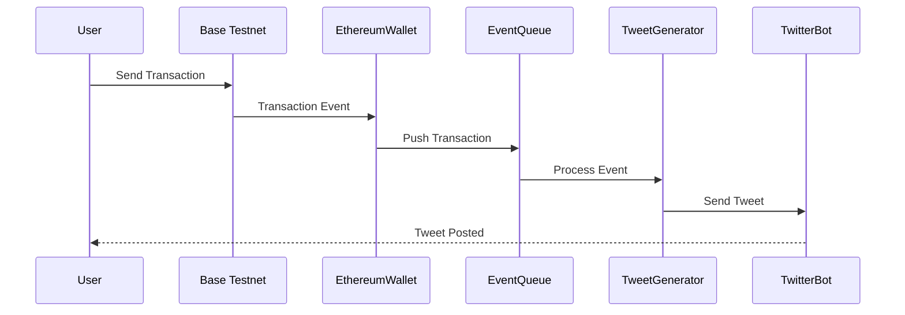
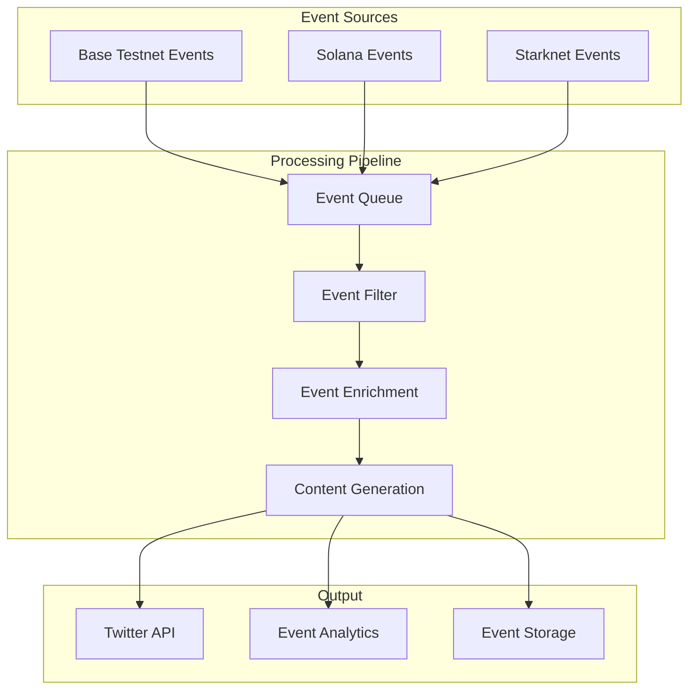
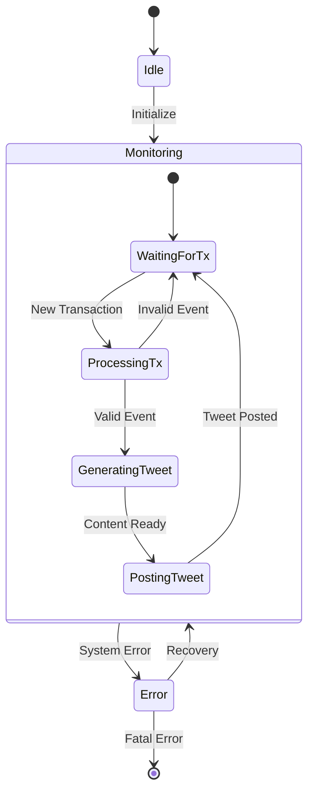

# Technical Architecture

## Component Architecture

<FullscreenDiagram>

</FullscreenDiagram>

## Transaction Flow

<FullscreenDiagram>

</FullscreenDiagram>

## Event Processing Architecture

<FullscreenDiagram>

</FullscreenDiagram>

## State Management

<FullscreenDiagram>

</FullscreenDiagram>

## Technical Details

### Event Queue Processing
- Events are processed in FIFO order
- Each event type (Base, Solana, Starknet) has specific validation rules
- Failed events are logged and can be retried
- Successful events trigger the tweet generation pipeline

### Transaction Monitoring
- Base Testnet: Monitors for incoming transactions to specified addresses
- Solana: Uses websocket subscription for real-time updates
- Starknet: Polls for new transactions periodically

### Tweet Generation
- Uses transaction data to generate contextual tweets
- Applies personality template based on Leo's character
- Includes relevant blockchain details and links
- Maintains conversation history for context

### Error Handling
- Automatic retry for failed API calls
- Circuit breaker pattern for external services
- Detailed error logging and monitoring
- Graceful degradation of services
